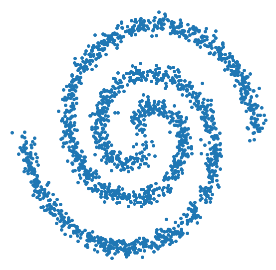
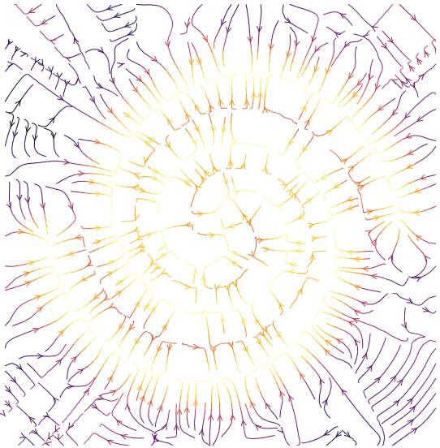
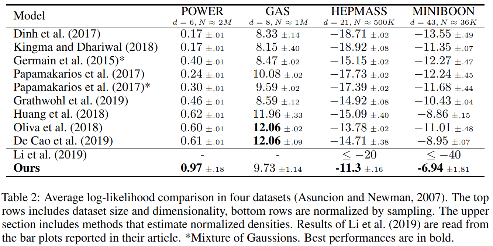

# Tutorial on DDEs using TensorFlow2

This is a brief tutorial on learning density (un-normalized) estimates using denoising density esimators (DDEs, [article here](https://arxiv.org/abs/2001.02728)).

| Samples from dataset | Learned density during training | learned density gradient field |
| --- | --- | --- |
|  |  |  |

Learning probabilistic models that can estimate the density of a given set of samples, and generate samples from that density, is one of the fundamental challenges in unsupervised machine learning.
Towards this, DDEs explicitly learn the [Kernel Density Estimate (KDE)](https://en.wikipedia.org/wiki/Kernel_density_estimation) from a dataset. From KDEs, one can measure how likely samples are with respect to each other. This leads to many applicaitons such as:
- sampling distrinutions (MCMC, Langevin, or training generative models),
- computing distance between densities (divrgence funcitons),
- Maximizing prior densities
- Anomaly/open-set/adverserial sample detection

Practicall, learning a DDE in higher dimentions is helpful in three ways:

1. Parametrized using deep neural networks, they can surpass the limits of computational KDEs when the data has regularities. (Some explaination [here](https://youtu.be/5BrNt38OraE?t=1242))
2. Inference takes only O(d) computation time, where d is the data dimentions, whearas computational KDEs take O(dD) time, where D is the numnber of elements in the dataset.
3. Gradients of DDEs are guaranteed to form a conservative vector field. (See the [discussion](https://www.inference.vc/my-notes-on-the-numerics-of-gans/) from Ference on non/conservative vector fields)

The code example uses Tensorflow 2, numpy, and matplotlib (for visualizaiton) 

## Demo files
- DDE_demo.ipynb: is a jupyter notebook with TF code to train DDEs
- utils.py: is a python file with helper functions to generate samples from toy 2D distributions

## Density estimation benchmark
DDEs can be used to estimate the normalized denstied using Monte Carlo estimation of the partition function (refer to the article for details).
The Average Log-Likelihood (ALL) results are state-of-the-art, with very small estimation variance.

 
